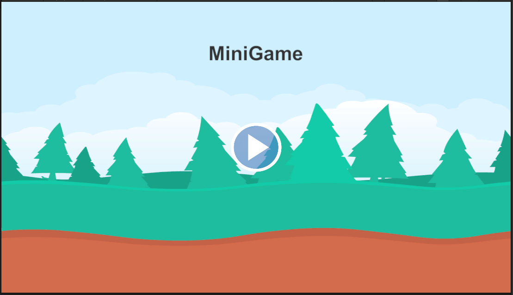

# Mini Game

Hi! This is the repositery of the **MiniGame**. New Concepts are learned in each plus in order to showcase the development skills.***This Repositery was soley made for learning concepts used in the game***

# Description

This is a simple game, where the purpose was to learn the newly learned concepts such as 

 - Prefab  
 - Instantiate  
 - Prefab Instantiate unity
 - Particle Effects 

The main purpose was to learn how to use above mentioned concepts easily and how one can use them in multiple scenario.

# Screenshots

